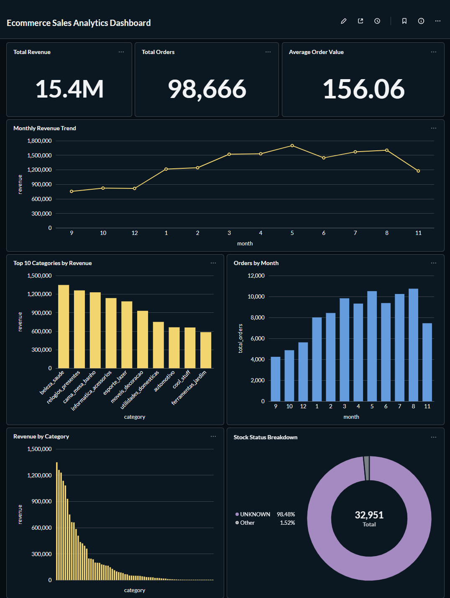

# Ecommerce Sales Analytics Pipeline


An end-to-end ecommerce analytics project built on the Brazilian Olist dataset (100k+ real orders). It ingests data from 3 sources (CSV files, PostgreSQL, REST API), transforms and validates it using Apache Spark, builds a star schema data warehouse, and surfaces business insights — revenue trends, category performance, inventory status — through a Metabase analytics dashboard. The entire pipeline is orchestrated and scheduled by Apache Airflow.

---

## Dataset

**Source:** [Brazilian E-Commerce Public Dataset by Olist](https://www.kaggle.com/datasets/olistbr/brazilian-ecommerce)

| Table        | Rows         | Source        |
|--------------|--------------|---------------|
| fact_sales   | 112,650      | Derived       |
| dim_customers| 99,441       | CSV           |
| dim_products | 32,951       | CSV + DB + API|
| dim_sellers  | 3,095        | PostgreSQL    |

---

## What it does

Every day Airflow triggers the pipeline which:

1. Pulls orders, customers, products and order items from Olist CSV files
2. Incrementally extracts sellers and inventory from PostgreSQL (only new records since last run using a watermark file)
3. Fetches live product metadata from the DummyJSON REST API
4. Transforms and cleans everything using Spark and writes to staging as Parquet
5. Validates data quality — fails the pipeline if row counts are 0 or key columns have nulls
6. Builds a star schema (fact_sales + 3 dims) and writes partitioned Parquet files
7. Loads everything into a PostgreSQL data warehouse via Spark JDBC
8. Visualizes warehouse data through Metabase dashboard at `http://localhost:3000`

---

## Architecture

```
                    ┌─────────────────────────────────┐
                    │        Apache Airflow            │
                    │   (Orchestration & Scheduling)   │
                    └────────────┬────────────────────┘
                                 │ triggers & monitors
         ┌───────────────────────┼───────────────────────┐
         │                       │                       │
┌────────▼──────┐    ┌───────────▼───────┐    ┌─────────▼─────┐
│   CSV Files   │    │    PostgreSQL      │    │   REST API    │
│  (Olist:      │    │  Source DB         │    │  (DummyJSON   │
│  orders,      │    │  (sellers,         │    │   products)   │
│  customers,   │    │   inventory)       │    │               │
│  products,    │    │  incremental load  │    │               │
│  order_items) │    │                    │    │               │
└────────┬──────┘    └───────────┬───────┘    └─────────┬─────┘
         │                       │                       │
         └───────────────────────┼───────────────────────┘
                                 │
                    ┌────────────▼────────────┐
                    │       Raw Layer          │
                    │   /data/raw/             │
                    │  (CSV files as-is)       │
                    └────────────┬────────────┘
                                 │
                    ┌────────────▼────────────┐
                    │     Apache Spark         │
                    │   raw_to_staging.py      │
                    │  - dedup                 │
                    │  - null filtering        │
                    │  - type casting          │
                    │  - column mapping        │
                    └────────────┬────────────┘
                                 │
                    ┌────────────▼────────────┐
                    │     Staging Layer        │
                    │   /data/staging/         │
                    │   (Parquet format)       │
                    └────────────┬────────────┘
                                 │
                    ┌────────────▼────────────┐
                    │    Data Validation       │
                    │   validate_data.py       │
                    │  - row count checks      │
                    │  - null checks on keys   │
                    │  - fails DAG if invalid  │
                    └────────────┬────────────┘
                                 │
                    ┌────────────▼────────────┐
                    │     Apache Spark         │
                    │ staging_to_processed.py  │
                    │  - star schema build     │
                    │  - fact_sales join       │
                    │  - dim enrichment        │
                    └────────────┬────────────┘
                                 │
                    ┌────────────▼────────────┐
                    │    Processed Layer       │
                    │   /data/processed/       │
                    │  (Parquet, partitioned   │
                    │   by year/month)         │
                    └────────────┬────────────┘
                                 │
                    ┌────────────▼────────────┐
                    │     Apache Spark         │
                    │   load_to_postgres.py    │
                    │   (Spark JDBC write)     │
                    └────────────┬────────────┘
                                 │
                    ┌────────────▼────────────┐
                    │   PostgreSQL             │
                    │   Data Warehouse         │
                    │   (star schema tables)   │
                    └────────────┬────────────┘
                                 │
                    ┌────────────▼────────────┐
                    │   Metabase               │
                    │   Analytics Dashboard    │
                    │   (localhost:3000)       │
                    └─────────────────────────┘
```

---

## Airflow DAG Flow

```
                    ┌─────────────────────────────────────┐
                    │        ecommerce_batch_pipeline      │
                    │        schedule: @daily              │
                    │        retries: 1 (after 5 mins)     │
                    └─────────────────────────────────────┘

  ┌─────────────┐   ┌─────────────┐   ┌─────────────┐
  │ extract_csv │   │ extract_db  │   │ extract_api │   ← parallel extraction
  └──────┬──────┘   └──────┬──────┘   └──────┬──────┘
         └─────────────────┼─────────────────┘
                           │
                  ┌────────▼────────┐
                  │  raw_to_staging │   ← Spark: clean + write Parquet
                  └────────┬────────┘
                           │
                  ┌────────▼────────┐
                  │  validate_data  │   ← fails DAG if quality checks fail
                  └────────┬────────┘
                           │
                  ┌────────▼──────────────┐
                  │  staging_to_processed │   ← Spark: star schema + partitioning
                  └────────┬─────────────┘
                           │
                  ┌────────▼────────┐
                  │ load_to_postgres│   ← Spark JDBC → PostgreSQL DW
                  └─────────────────┘
```

---

## Why these tools?

- **Airflow** — industry standard for orchestrating batch pipelines. DAG makes dependencies and scheduling explicit and visible
- **Spark** — handles 100k+ rows efficiently. Practiced Spark transformations and JDBC writes the way you'd use them on large datasets
- **Parquet** — columnar format, much faster for analytical queries than CSV. Also supports partitioning natively
- **Star schema** — standard for data warehouses. Keeps the fact table lean and dimensions reusable across queries
- **Watermark for incremental load** — simple file-based approach. In production you'd use a metadata table in the DB instead
- **Airflow LocalExecutor** — enough for a single-node setup. CeleryExecutor would be needed for distributed workers
- **Metabase** — open source BI tool containerized with the pipeline. Connects directly to the PostgreSQL warehouse so business users can explore data without writing SQL

---

## Project Structure

```
ecommerce-sales-batch-pipeline/
├── dags/
│   └── ecommerce_batch_pipeline.py   # Airflow DAG — defines task flow and schedule
├── jobs/
│   ├── extraction/
│   │   ├── extract_csv.py            # Copies CSV files to raw layer
│   │   ├── extract_db.py             # Incremental extraction from PostgreSQL using watermark
│   │   └── extract_api.py            # Fetches product metadata from DummyJSON API
│   ├── profiling/
│   │   └── profile_raw_data.py       # Profiles all 7 raw datasets before cleaning
│   ├── transformation/
│   │   ├── raw_to_staging.py         # Spark: cleans raw data → staging Parquet
│   │   └── staging_to_processed.py   # Spark: builds star schema → processed Parquet
│   ├── validation/
│   │   └── validate_data.py          # Row count + null checks, raises exception on failure
│   └── warehouse/
│       └── load_to_postgres.py       # Spark JDBC write to PostgreSQL data warehouse
├── data/
│   ├── raw/                          # Raw ingested files (CSV)
│   ├── staging/                      # Cleaned Parquet files
│   └── processed/                    # Star schema Parquet (fact_sales partitioned by year/month)
├── sql/
│   ├── source_db_init.sql            # Creates and seeds source DB tables (Olist sellers + inventory)
│   └── generate_sql.py               # Generates source_db_init.sql from Olist CSV files
├── profiling_results.txt             # Output of profile_raw_data.py — evidence for cleaning decisions
├── dashboard/                        # Metabase dashboard screenshots
├── .env.example
├── docker-compose.yml
├── requirements.txt
└── README.md
```

---

## Data Warehouse Schema (Star Schema)

**fact_sales** *(partitioned by year, month)*
| Column | Type | Description |
|--------|------|-------------|
| order_id | STRING | FK to order |
| product_id | STRING | FK to dim_products |
| customer_id | STRING | FK to dim_customers |
| quantity | INT | Item sequence number |
| order_date | DATE | Date of order |
| status | STRING | Order status |
| unit_price | DOUBLE | Price at time of sale |
| freight_value | DOUBLE | Shipping cost |
| sale_amount | DOUBLE | quantity × unit_price |
| year | INT | Partition column |
| month | INT | Partition column |

**dim_customers** *(99,441 rows)*
| Column | Type |
|--------|------|
| customer_id | STRING |
| customer_name | STRING |
| email | STRING |
| signup_date | DATE |

**dim_products** *(32,951 rows — enriched from CSV + DB + API)*
| Column | Type | Source |
|--------|------|--------|
| product_id | STRING | CSV |
| product_name | STRING | Derived |
| category | STRING | CSV |
| price | DOUBLE | Derived from order_items |
| stock_quantity | INT | PostgreSQL |
| warehouse_location | STRING | PostgreSQL |
| brand | STRING | API |
| rating | DOUBLE | API |
| stock_status | STRING | Derived |

**dim_sellers** *(3,095 rows)*
| Column | Type |
|--------|------|
| seller_id | STRING |
| seller_name | STRING |
| city | STRING |
| state | STRING |

---

## Data Profiling

Before writing any cleaning logic, all 7 raw datasets were profiled using
`jobs/profiling/profile_raw_data.py`. Full output is saved in `profiling_results.txt`.

Key findings that directly shaped the cleaning logic in `raw_to_staging.py`:

| Dataset | Finding | Action Taken |
|---------|---------|---------------|
| customers | 0 nulls, 0 duplicates on `customer_id` | Defensive filters applied. `email` and `signup_date` missing entirely — derived |
| orders | `order_purchase_timestamp` stored as string | Cast to DATE using `to_date()` |
| orders | 2,965 nulls on `order_delivered_customer_date` | Kept — expected for undelivered orders, not a join key |
| products | `product_category_name` has 610 nulls | Kept — `product_id` still valid for joining |
| products | `price` column missing entirely | Derived by joining `order_items` and calculating avg price per product |
| inventory | `last_updated` stored as string | Cast to DATE using `to_date()` |
| product_metadata | `brand` has 15 nulls | Kept — brand is optional enrichment, not a join key |
| product_metadata | Column named `id` not `product_id` | Renamed to match pipeline schema |

`dropDuplicates` and `isNotNull` filters are applied on all datasets as **defensive coding** —
the pipeline runs daily and cannot guarantee every future batch will be as clean as the current data.

---

## Setup & Run

### Prerequisites
- Docker Desktop running
- Git
- Olist dataset downloaded from [Kaggle](https://www.kaggle.com/datasets/olistbr/brazilian-ecommerce)

### Steps

**1. Clone the repo**
```bash
git clone <repo-url>
cd ecommerce-sales-batch-pipeline
```

**2. Create your `.env` file**
```bash
cp .env.example .env
```
Update the values in `.env` if needed.

**3. Place Olist CSV files in `data/raw/csv/`**
```
orders.csv         ← olist_orders_dataset.csv
customers.csv      ← olist_customers_dataset.csv
products.csv       ← olist_products_dataset.csv
order_items.csv    ← olist_order_items_dataset.csv
```

**4. Generate source DB SQL from Olist sellers data**
```bash
python sql/generate_sql.py
```

**5. Start all containers**
```bash
docker-compose up -d
```

**6. Wait ~2 minutes for Spark to finish installing dependencies**
```bash
docker-compose logs spark
```

**7. Initialize source database tables**

Windows (PowerShell):
```powershell
Get-Content sql/source_db_init.sql | docker exec -i ecommerce_postgres psql -U admin -d ecommerce_dw
```

Mac/Linux:
```bash
cat sql/source_db_init.sql | docker exec -i ecommerce_postgres psql -U admin -d ecommerce_dw
```

**8. Create Airflow admin user**
```bash
docker exec -it ecommerce_airflow_webserver airflow users create --username <username> --password <password> --firstname Admin --lastname User --role Admin --email <email>
```

**9. Open Airflow UI and trigger the DAG**
```
http://localhost:8080
Username: <your-username>
Password: <your-password>
```

Go to `ecommerce_batch_pipeline` → click ▶ to trigger manually.

**10. Open Metabase dashboard**
```
http://localhost:3000
```
Create admin account → connect to PostgreSQL → build dashboards from the warehouse tables.

---

## Analytics Dashboard

This project includes **Metabase** as the BI/dashboard layer for analytics interviews and
data engineering portfolio demos.

Metabase connects to the PostgreSQL data warehouse after the Airflow pipeline loads:

- `dim_customers`
- `dim_products`
- `dim_sellers`
- `fact_sales`

### Dashboard Preview



### Open Metabase

After starting Docker Compose:

```bash
docker-compose up -d
```

open:

```
http://localhost:3000
```

Create the first Metabase admin account from the browser setup screen.

### Connect Metabase to PostgreSQL

Use these database connection values inside Metabase:

| Field | Value |
|-------|-------|
| Database type | PostgreSQL |
| Host | postgres |
| Port | 5432 |
| Database name | value of `POSTGRES_DB` from `.env` |
| Username | value of `POSTGRES_USER` from `.env` |
| Password | value of `POSTGRES_PASSWORD` from `.env` |

If connecting from a desktop BI tool like Power BI or Tableau instead of Metabase, use:

| Field | Value |
|-------|-------|
| Host | localhost |
| Port | 5432 |

### Recommended Dashboard

Create a dashboard named:

```
Ecommerce Sales Analytics Dashboard
```

Recommended cards:

1. Total revenue
2. Total orders
3. Monthly revenue trend
4. Top 10 categories by revenue
5. Revenue by product category
6. Stock status breakdown
7. Average order value
8. Orders by month

Example SQL queries:

```sql
SELECT SUM(sale_amount) AS total_revenue
FROM fact_sales;
```

```sql
SELECT COUNT(DISTINCT order_id) AS total_orders
FROM fact_sales;
```

```sql
SELECT year, month, SUM(sale_amount) AS revenue
FROM fact_sales
GROUP BY year, month
ORDER BY year, month;
```

```sql
SELECT p.category, SUM(f.sale_amount) AS revenue
FROM fact_sales f
JOIN dim_products p ON f.product_id = p.product_id
GROUP BY p.category
ORDER BY revenue DESC
LIMIT 10;
```

```sql
SELECT p.category, SUM(f.sale_amount) AS revenue
FROM fact_sales f
JOIN dim_products p ON f.product_id = p.product_id
GROUP BY p.category
ORDER BY revenue DESC;
```

```sql
SELECT stock_status, COUNT(*) AS product_count
FROM dim_products
GROUP BY stock_status
ORDER BY product_count DESC;
```

```sql
SELECT SUM(sale_amount) / COUNT(DISTINCT order_id) AS average_order_value
FROM fact_sales;
```

```sql
SELECT year, month, COUNT(DISTINCT order_id) AS total_orders
FROM fact_sales
GROUP BY year, month
ORDER BY year, month;
```


---

## What I'd improve with more time


- Replace file-based watermark with a proper metadata table in PostgreSQL — more reliable and queryable
- Add schema validation (check column types, not just nulls)
- Use `append` mode instead of `overwrite` for true incremental loads into the warehouse
- Add a Great Expectations integration for more robust data quality checks
